  

  

  
  
  
  

  
  

---

## 👋 Hey there

I'm **Sudip Paudel** a full-stack and systems developer from **Nepal 🇳🇵**.

I work across the whole stack, but my main focus is **React + TypeScript** on one side of the
wire and **Rust or C** on the other, and being the person who can debug both.

I care about **readable code**, **honest benchmarks**, and shipping things that still make sense
six months later. Most of what I build is tooling, terminal utilities, editor configs, and
small programs that remove a papercut I've personally hit too many times.

---

## 🧰 Stack

---

## 📊 Stats

  
  
  

  

---

## 🚀 Featured work

<table>
  <tr>
    <td width="50%">
      
      <h3 align="center"><a href="https://github.com/BayonetArch/hypr_zoomer">🔍 Hypr Zoomer</a></h3>
      
<strong>High-performance screen magnifier & live annotator for Wayland compositors</strong>

      

        A Wayland take on Tsoding's <code>boomer</code>. Physics-based zoom and panning with a
        damped spring, so the point under your cursor stays put. Flashlight/spotlight mode,
        freehand pen + arrow + rectangle annotations with undo/redo, bilinear &amp; nearest-neighbour
        scaling, a pixel grid at high zoom, and a live readout of cursor coords and hex colour.
        Roughly 30 keybindings, TOML config, MIT.
      

      

        
        
        
        
      

      

        <a href="https://github.com/BayonetArch/hypr_zoomer"><b>source</b></a>
        &nbsp;·&nbsp;
        <code>cargo install hypr_zoomer</code>
      

    </td>
    <td width="50%">
      
      <h3 align="center"><a href="https://github.com/BayonetArch/tx_launch">🚀 Tx Launch</a></h3>
      
<strong>Launch Android apps by friendly name, straight from Termux</strong>

      

        Type <code>playstore</code> instead of <code>com.android.vending</code>. Ships with an
        interactive REPL (<code>list</code>, <code>help</code>) plus a one-shot
        <code>--run</code> for scripts, with fuzzy name suggestions when you miss. You pick the
        backend: the bundled Termux <code>am</code>, the faster <code>termux-am</code> from CI
        builds, or the system <code>am</code>. Prebuilt binaries in Releases. MIT.
      

      

        
        
        
        
      

      
<a href="https://github.com/BayonetArch/tx_launch/releases"><b>download</b></a>

    </td>
  </tr>
  <tr>
    <td width="50%">
      
      <h3 align="center"><a href="https://github.com/BayonetArch/termux-mdwm">🪟 termux-mdwm</a></h3>
      
<strong>Minimal <code>dwm</code> setup for Termux with GPU acceleration</strong>

      

        A tiled window manager for Android, running inside Termux. A minimal <code>dwm</code>
        config that actually gets you a GPU-accelerated, keyboard-driven tiling WM on a phone
        instead of scrolling a terminal emulator. Written in C. MIT.
      

      

        
        
        
        
      

    </td>
    <td width="50%">
      
      <h3 align="center"><a href="https://github.com/BayonetArch/film-pivot-react">🎬 Film Pivot</a></h3>
      
<strong>Movie search — a React rewrite of my older Film Pivot site</strong>

      

        Type a title, and the query is debounced against the OMDb API. Built with
        <b>React 19</b>, <b>Vite</b> and <code>react-router-dom</code>, styled with CSS Modules
        and animated with the <b>View Transitions API</b>. Deployed on Vercel. This one's a
        learning project the older version was vanilla.
      

      

        
        
        
        
      

      

        <a href="https://github.com/BayonetArch/film-pivot-react"><b>source</b></a>
        &nbsp;·&nbsp;
        <a href="https://film-pivot-react.vercel.app/"><b>live site</b></a>
      

    </td>
  </tr>
</table>

### 🎥 Neo Kut (work in progress)

A **native video editor written in Rust**, and my most ambitious project so far.
Video pipeline via `gstreamer-rs`, GUI via `egui`, cross-platform windowing via `winit`.
The goal is an open-source NLE with no annoying popups, upscaling, or telemetry.

It's still a solo WIP and not public yet, but the entire build is documented live:

---

## 📦 crates.io

Five published crates mostly terminal plumbing, all MIT.

| Crate | Description | 📦 Downloads |
|---|---|---|
| [`hypr_zoomer`](https://github.com/BayonetArch/hypr_zoomer) | Wayland screen magnification, zoom & live annotation |  |
| [`simple_term_attr`](https://github.com/BayonetArch/simple_term_attr) | Terminal attributes. clear, move, colours |  |
| [`spb`](https://github.com/BayonetArch/spb) | A small progress bar that drops into any project |  |
| [`readable_time`](https://github.com/BayonetArch/readable_time) | Date & time without the dependency headache |  |
| [`simplert`](https://github.com/BayonetArch/simplert) | A minimal CLI alarm clock and timer |  |

## 🧪 More experiments

Everything else I've been poking at small utilities, libs, and configs.

| Repo | What it is | Lang |
|---|---|---|
| [`beer`](https://github.com/BayonetArch/beer) | A fast TUI text editor *(paused, will return)* | Rust |
| [`cinit`](https://github.com/BayonetArch/cinit) | Scaffolds a C project with a sane structure | Rust |
| [`rrg`](https://github.com/BayonetArch/rrg) | `rip`‑`ripgrep`,a learning project tool | Rust |
| [`simplert`](https://github.com/BayonetArch/simplert) | Minimal CLI alarm clock & timer for Linux | Rust |
| [`cx.h`](https://github.com/BayonetArch/cx.h) | An essential single header file for C projects | C |
| [`c-sims`](https://github.com/BayonetArch/c-sims) | Simulations in C | C |
| [`termux-nvim-setup`](https://github.com/BayonetArch/termux-nvim-setup) | Neovim in Termux with LSP support ⭐ | Lua |
| [`tx-dev`](https://github.com/BayonetArch/tx-dev) | Dev setup for Termux, with all the essential configs | Shell |
| [`mini-react`](https://github.com/BayonetArch/mini-react) | Bootstraps a React project with clean state | Shell |
| [`CleanTab`](https://github.com/BayonetArch/CleanTab) | Chrome new-tab with just a wallpaper, Rosé Pine theme | HTML |
| [`insta_upload`](https://github.com/BayonetArch/insta_upload) | Script to automate Instagram reel uploads | Python |

---

## 📬 Say hi

Open to **freelance work** and **full-time roles** involving full-stack or systems engineering.

- 🌐 [sudippaudel.info.np](https://sudippaudel.info.np) — portfolio & write-ups
- 💻 [github.com/BayonetArch](https://github.com/BayonetArch) — code, mostly
- 💼 [linkedin.com/in/sudip-paudel](https://www.linkedin.com/in/sudip-paudel-a149aa43a)
- ✉️ [sudipxd123@gmail.com](mailto:sudipxd123@gmail.com)
- 🎥 [Neo Kut devlog on YouTube](https://www.youtube.com/playlist?list=PLfAdp-IXqUzs)

---

  
    Hand-written with <code>neovim</code>.
    Banner drawn in SVG. 
  

